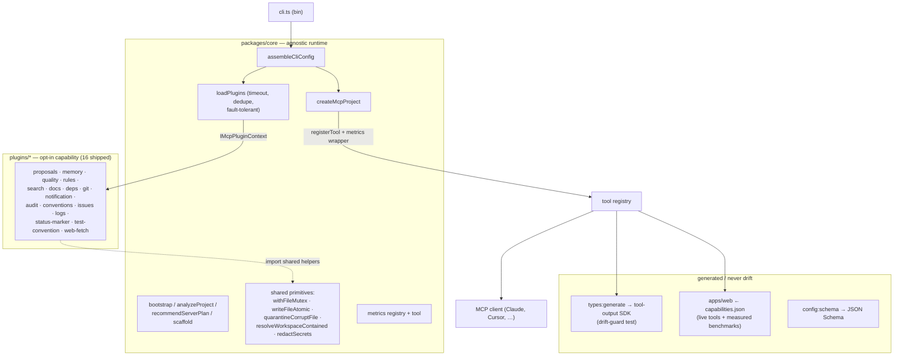

# Architecture — `@mcp-vertex/core`

How the monorepo fits together, what the boundaries are, and which invariants hold
across them. For the working rules see [`AGENTS.md`](../AGENTS.md); for the live
roadmap see [`docs/proposals/audits/`](proposals/audits/).

## The one idea

A **small, project-agnostic core** that knows how to assemble and serve an MCP
server, plus **opt-in plugins** that carry all the domain capability. The core
never imports a plugin and never encodes a host's vocabulary; plugins receive
everything they need — resolved paths, options, namespace — through a single
context object. That separation is what lets the same plugin behave identically
under any host or model.

## Layers

| Layer | Path | Responsibility | Depends on |
|---|---|---|---|
| **Core runtime** | `packages/core` | Tool registry, plugin loader, bootstrap/scaffold, metrics, shared FS primitives, CLI. **No domain logic.** | only `@modelcontextprotocol/sdk`, `zod` |
| **Plugins** | `plugins/*` | One capability each, namespaced. Receive `IMcpPluginContext`. | `@mcp-vertex/core/public` |
| **Site** | `apps/web` | Astro product/docs site, generated from the **live** registry. | core + all plugins (build-time only) |
| **Examples** | `examples/*` | Minimal host, custom plugin, swarm. | core (+ plugins) |
| **Scripts** | `scripts/*` | build · derive-version · release · type/schema generation. Pure planning split from side-effecting shells. | core |

The dependency arrow only ever points **plugin → core**, never the reverse.

## Key contracts (`packages/core/src/lib/contracts`)

- **`IMcpPlugin` / `definePlugin`** — a plugin is `{ name, optionsSchema?, register(ctx) }`
  returning `{ tools, prompts, resources, knowledge }`.
- **`IMcpPluginContext`** — `workspace`, `corePaths`, `pluginCacheDir`, `pluginDocsDir`,
  `namespacePrefix`, `options`, `args`. Everything a plugin needs, pre-resolved.
- **`IToolRegistration`** — `{ id, summary, tags, register(server) }`; each tool declares
  an `inputSchema` and an `outputSchema` (Zod). An e2e guard fails the build if any tool
  omits its `outputSchema`.
- **`IWorkspacePathProvider`**, **`IStatusCollector`**, **`IValidationMatrix`** — the host
  surfaces the core consumes.

## How a request flows

1. `cli.ts` parses args (`parseCliArgs`) and calls `assembleCliConfig`.
2. `loadPlugins` resolves each `--plugins=` specifier (short name, scoped package, path),
   dedupes, and imports under a timeout; a broken plugin is skipped, never fatal.
3. `createMcpProject` registers every tool deterministically, wrapping each with the
   metrics collector (latency, bytes, errors) before exposing it.
4. The server serves over stdio. `overview` gives a one-call, low-token map; `auto_work`
   gives a tight next-action plan plus a delegation policy for non-trivial slices.

## Cross-cutting invariants

- **Agnostic core** — no domain code, no `process.cwd()` in engines (paths are injected).
- **Async I/O in hot paths** — `fs/promises`; `*Sync` only in documented boot one-shots.
- **Durable writes** — `withFileMutex` (ownership token + heartbeat + steal-on-stale) +
  `writeFileAtomic`; corrupt ≠ empty (`quarantineCorruptFile`).
- **Contained paths** — workspace-scoped path inputs go through `resolveWorkspaceContained`.
- **No secret leakage** — durable stores run text through `redactSecrets`.
- **Measured token budget** — `overview`/`auto_work` stay under e2e-guarded ceilings.
- **No drift** — the typed SDK, the site's `capabilities.json` and the config schema are
  all generated from the live registry; drift-guards fail the build.
- **Single orchestrator contract** — `mcp-vertex` is the only source of truth for the
  orchestrator workflow. Client adapters (`.github/agents/mcp-vertex.agent.md`,
  `.claude/agents/mcp-vertex-orchestrator.cc.md`) are thin redirectors that load
  `mcp-vertex_overview`'s `recommendedNextAction` instead of restating the workflow
  in prose; `bun run lint:agents` warns on drift (f00031).

## Build, test, release

- **Build:** `bun scripts/build.ts` → per-package `dist/` (`bun build` ESM + `tsc
  --emitDeclarationOnly`); `exports`/`bin` point at `.js`/`.d.ts` so `npx`/`node` work.
- **Test:** Vitest — unit, concurrent-chaos (multi-process locks), e2e over a real
  in-memory MCP server (outputSchema + token budget), drift-guards.
- **Release:** push to `main` → Conventional Commits derive the version
  (`scripts/derive-version.ts`) → tag + publish, lockstep, no commit-back loop.
- **CI:** lint · typecheck+coverage · pack-smoke (`npm pack --dry-run` + a functional
  stdio smoke of the compiled CLI) · Pages (site in `--strict`).

See [`README-MCP-VERTEX.md`](README-MCP-VERTEX.md) (host authors),
[`PLUGINS-MCP-VERTEX.md`](PLUGINS-MCP-VERTEX.md) (plugin authors) and
[`TOKEN-BUDGETS.md`](TOKEN-BUDGETS.md) (the measured low-token proof).
